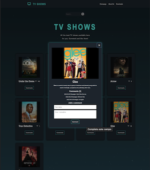

# TV Shows

> In this project we built a webpage where the user can search for different TV shows, comment them and like them.

[Video](https://drive.google.com/file/d/1oIEWXL32SoS9nXczNdZc_bgM4KHWxMma/view?usp=sharing);

## Built With

- Major languages: HTML, CSS, JS, Jest.
- Technologies used: Webpack, VSCode, git, GitHub, Gitflow
- API: https://api.tvmaze.com/show

## Live Demo

[Live Demo Link](https://giuseppetg.github.io/TVmaze/dist)

## Getting Started

**To get a local copy up and running follow these simple example steps.**

### Prerequisites

- Node
- Git
- Code Editor
- Browser

### Setup

- Clone the repository
- Change directory into the project folder

### Install

`npm install`

### Usage

`npm run build`
`npm start`

### Run tests

Test: `npm test`

## Authors

👤 **Giuseppe Tomasini**

- GitHub: [@GiuseppeTG](https://github.com/GiuseppeTG)
- Twitter: [@giusetomasini](https://twitter.com/giusetomasini)
- LinkedIn: [Giuseppe Tomasini](https://www.linkedin.com/in/giuseppe-tomasini-67ba101a8/)

👤 **Alfred Boateng**

- GitHub: [@learnwithalfred](https://github.com/learnwithalfred)
- Twitter: [@kb_alfred](https://twitter.com/kb_alfred)
- LinkedIn: [Alfred Boateng](https://www.linkedin.com/in/alfred-boateng-704670138/)

## 🤝 Contributing

Contributions, issues, and feature requests are welcome!

Feel free to check the [issues page](../../issues/).

## Show your support

Give a ⭐️ if you like this project!

## Acknowledgments

- Free source API by [TV Maze](https://www.tvmaze.com/api)
- Inspiration
- etc

## 📝 License

This project is [MIT](./MIT.md) licensed.
